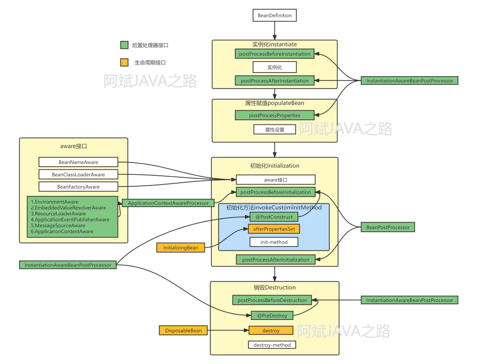

## 1. Spring入门案例
1. Module: [Spring-01-Demo](Spring-01-Demo)
2. Module: [Spring-02-IoC-xml](Spring-02-IoC-xml)
   * 这个module是通过xml实现IoC配置的演示项目工程，暂时忽略，所以只是创建这个module作为一个placeholder，并没有代码实现。

## 2. IoC based on XML

## 3. IoC based on Annotation
### 3.1 对象的创建
```java
// Step 1: 启动注解扫描

// Step 2: 创建对象
@Component
@Repository
@Service
@Controller

// Step 3: 依赖注入:
// 3.1 @Autowired
// 3.2 @Resource

// Step 4: 使用
applicationContext.getBean(xxx);
```

### 3.2 对象的注入
#### 1. 通过`@Autowired`实现依赖注入
1. 场景一: 属性注入
2. 场景二: setter方法注入
3. 场景三: 构造器注入
4. 场景四: 形参上注入
5. 场景五: 只有一个构造器，无注解
6. 场景六: `@Autowired + @Qualifier`组合使用

#### 2. 通过`@Resource`实现依赖注入
⚠️注意: `@Resource`注解属于JDK扩展包，所以不在JDK当中，需要额外引⼊以下依赖：【如果是JDK8的话不需要额外引⼊依
赖。⾼于JDK11或低于JDK8需要引⼊以下依赖。
```xml
<!-- https://mvnrepository.com/artifact/jakarta.annotation/jakarta.annotation-api -->
<dependency>
    <groupId>jakarta.annotation</groupId>
    <artifactId>jakarta.annotation-api</artifactId>
    <version>3.0.0</version>
</dependency>
```

`@Resource`注解：默认byName注⼊，没有指定name时把属性名当做name，根据name找不到时，才会byType注
⼊。 byType注⼊时，某种类型的Bean只能有⼀个

#### ⚠️注意
* 将通过@Autowired实现注入的事例代码放入`com.atguigu.autowired`包下，
* 将通过@Resource实现注入的事例代码放入`com.atguigu.resource`包下.
* 使用`@Resource`注解需要引入JDK扩展包，Jakarta

## Spring Bean生命周期


## Resource
* 课件: [Spring6.pdf](docs/Spring6.pdf)
* 友人的编程指南(CoderMast): [Spring](https://www.codermast.com/spring-series/spring/)
* https://github.com/codermast/Spring6
* [一张图搞定SpringBean的生命周期，再也不怕繁多的回调接口啦！](https://www.modb.pro/db/422673)